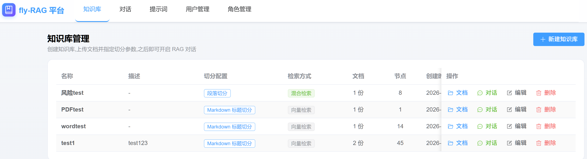
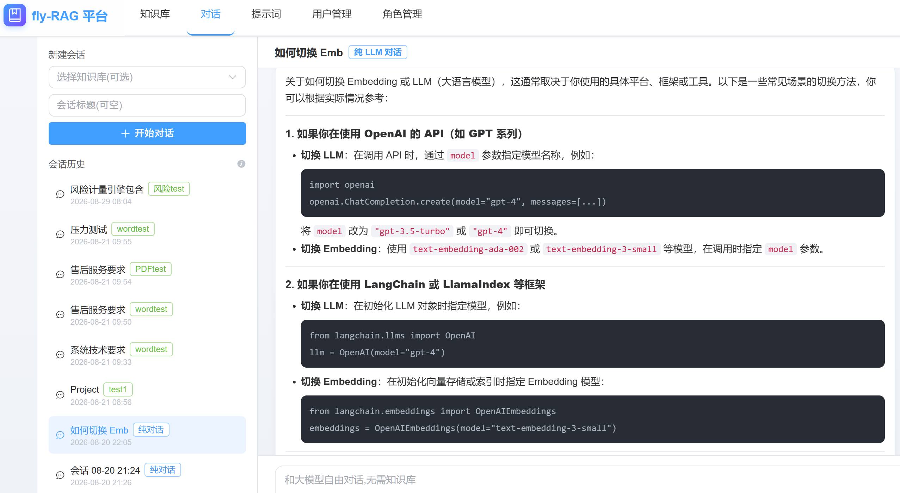
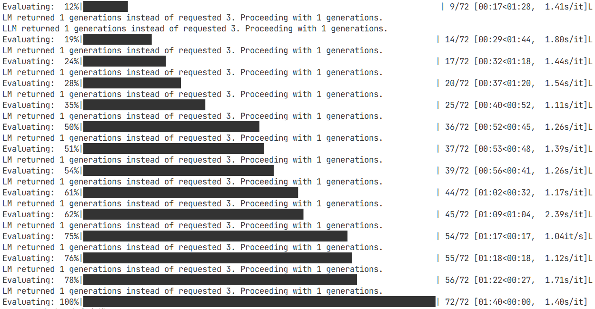

# fly-rag

> 基于 **LlamaIndex** 的多格式文档 → 切分 → 向量化(Milvus)→ RAG 对话 完整流水线，支持 Web 界面与 RAGAS 评估。

---

## 1. 项目简介

本项目演示了如何用 LlamaIndex 解析 **Word / Excel / PDF / Txt / Markdown / HTML / JSON / Web** 等多种数据源,
经过切分后写入 **Milvus** 向量数据库,并通过 **OpenAI 兼容的 LLM** 实现带记忆的检索增强对话(RAG Chat)。

适合作为企业内部知识库、文档问答机器人、客服助手的脚手架。

**核心特性**:
- **多格式解析** —— Word/Excel/PDF/MD/HTML/JSON/Web,以及通过 anydoc 支持 PPT/RTF/EPUB/CSV 等更多格式
- **多种切分器** —— 句子、Token、Markdown、HTML、JSON、代码、语义切分
- **父子检索** —— 层级三段切分,叶子小块入 Milvus 精准命中,自动回查完整父块作为上下文(小 → 大)
- **Milvus 持久化** —— 嵌入式(零依赖)与集群模式皆可
- **混合检索** —— 基于 Milvus 2.5 内置 BM25 Function 的全文/混合检索(免训练稀疏模型),知识库级可配置 dense / sparse / hybrid / parent_child 四种检索方式与融合排序参数
- **OpenAI 兼容 LLM** —— 支持 DeepSeek / 通义千问 / Ollama / vLLM / dmxapi 等
- **两种对话模式** —— 多轮问题改写(Condense)与原文直接检索(自实现引擎)
- **Web 界面** —— FastAPI + Vue3 前端，支持多知识库管理、批量文档上传、RAG 对话、Markdown 渲染回答
- **登录与 RBAC** —— JWT 登录认证 + 角色/权限管理,业务接口统一强制登录
- **全链路 Debug 日志** —— 系统提示词 / 检索节点 / LLM prompt / 模型返回 一键打印
- **三档配置优先级** —— 调用参数 > `config.py` > 环境变量

---

## 2. rag 架构 

```
┌────────────────────────┐
│  dataLoader (解析)     │  Word / Excel / PDF / Txt / MD / HTML / JSON / Web
└──────────┬─────────────┘
           │  List[Document]
           ▼
┌────────────────────────┐
│  spliter   (切分)      │  Sentence / Token / Markdown / HTML / JSON / Code / Semantic
└──────────┬─────────────┘
           │  List[BaseNode]
           ▼
┌────────────────────────────────────────────────┐
│  vectorStore (Milvus + 对话)                    │
│   ├── milvus_store.py  : 写入/加载/自检        │
│   ├── callbacks.py     : RAGDebugHandler       │
│   ├── custom_engine.py : CustomRAGChatEngine   │
│   └── chat.py          : build_chat_engine()   │
└──────────┬─────────────────────────────────────┘
           │  VectorStoreIndex
           ▼
┌────────────────────────┐
│  chat(检索对话)        │  Retriever → Context → LLM → 回答
└────────────────────────┘
```

**Web 架构**:
```
frontend/ (Vue3 + Element Plus)          用户界面
        │  /api (vite 代理 -> 8000)
        ▼
api/ (FastAPI)                            REST 服务
 ├── routers/kb.py        知识库 CRUD
 ├── routers/documents.py 批量上传 / 状态轮询 / 删除 / 重试
 ├── routers/chat.py      会话管理 / RAG 问答
 └── services/            后台解析(线程池) / 引擎缓存
        │
        ├── MySQL(kb_rag)   知识库 / 文档 / 会话 / 消息 元数据
        └── Milvus(kb_{id}) 每个知识库一个 collection,数据隔离
```

---





## 3. 快速开始

### 3.1 安装依赖

```bash
# 创建虚拟环境
python -m venv .venv
.\.venv\Scripts\activate           # Windows
# source .venv/bin/activate        # Linux/Mac

# 安装后端依赖
pip install -r requirements.txt

# 本地嵌入式 Milvus
pip install pymilvus[milvus_lite]

# 安装前端依赖
cd frontend && npm install
```

### 3.2 配置环境变量

```bash
# OpenAI 兼容的 LLM / Embedding
set OPENAI_API_KEY=sk-xxxxxx
set OPENAI_BASE_URL=https://api.openai.com/v1
set LLM_MODEL=gpt-4o-mini
set EMBED_MODEL=text-embedding-3-small
set EMBED_DIM=1536

# Milvus(嵌入式本地模式)
set MILVUS_URI=./milvus_llamaindex.db
set MILVUS_COLLECTION=llamaindex_rag
set MILVUS_OVERWRITE=true

# 混合检索(BM25 全文检索,可全部省略使用默认值)
set MILVUS_ENABLE_HYBRID=true          # 建表带稀疏字段 + BM25 Function
set MILVUS_ANALYZER_TYPE=jieba         # BM25 分词器(milvus-lite 仅支持 standard/jieba)
set MILVUS_HYBRID_RANKER=RRFRanker     # 融合排序: RRFRanker / WeightedRanker
set MILVUS_HYBRID_RANKER_PARAMS={"k":60}   # WeightedRanker 用 {"weights":[1.0,1.0]}

# MySQL(用于 Web 界面)
set MYSQL_HOST=127.0.0.1
set MYSQL_PORT=3306
set MYSQL_USER=root
set MYSQL_PASSWORD=root
set MYSQL_DB=kb_rag
```

> 完整配置字段见 [config.py](./config.py) 和 [api/api_config.py](./api/api_config.py)。

### 3.3 初始化数据库

```bash
mysql -uroot -p < sql/init.sql
```

### 3.4 启动服务

**方式 A: CLI 模式(脚本化)**

```python
from main import ingest_file, start_chat
from vectorStore import load_existing_index

# 解析单文件 -> 切分 -> 入库
index = ingest_file("Oracle-19c-安装及常用命令.md")

# 启动对话
start_chat(index, enable_question_rewriting=False, debug=True)
```

**方式 B: Web 界面(推荐)**

```bash
# 启动后端 API
python run_server.py
# 访问 http://localhost:8000/docs 查看 API 文档

# 启动前端(新终端)
cd frontend
npm run dev
# 访问 http://localhost:5173
```

---

## 4. 核心模块

### 4.1 `dataLoader` — 文档解析

| 函数 | 用途 |
|---|---|
| `load_word(path)` | `.docx` |
| `load_excel(path)` | `.xlsx` / `.xls` |
| `load_pdf_auto(path, backend="pymupdf")` | `.pdf`(推荐 pymupdf) |
| `load_txt/markdown/html/json(path)` | 文本类文档 |
| `load_anydoc(path)` | PPT/RTF/EPUB/CSV 等(需安装 anydoc) |
| `load_web(urls)` | 网页抓取 |
| `auto_load(path)` | 按后缀自动选 loader |
| `load_directory(dir)` | 批量加载目录 |

### 4.2 `spliter` — 文档切分

| 函数 | 说明 |
|---|---|
| `split_by_sentence(docs, chunk_size=1024, chunk_overlap=200)` | 句子切分(**默认**) |
| `split_by_token(docs, chunk_size=512)` | Token 切分 |
| `split_markdown/html/json(docs)` | 结构化切分 |
| `split_code(docs, language="python")` | 代码切分 |
| `auto_split(docs, doc_type="text")` | 按类型自动选 splitter |

### 4.3 `vectorStore` — Milvus + 对话

| 函数 | 说明 |
|---|---|
| `configure_settings(embed_model, llm, chunk_size, chunk_overlap)` | 全局注册配置 |
| `build_milvus_store(collection_name, dim, overwrite, enable_hybrid, hybrid_ranker, hybrid_ranker_params, ...)` | 构造 Milvus 客户端;`enable_hybrid=True` 时建表带稀疏字段 + BM25 Function |
| `create_index(nodes, milvus_store)` | 写入 Milvus 并构建索引 |
| `load_existing_index(milvus_store)` | 加载已存在的 collection |
| `build_chat_engine(index, enable_question_rewriting, debug)` | 构造对话引擎 |
| `CustomRAGChatEngine` | 自实现的 Chat Engine |
| `RAGDebugHandler` | 全链路日志回调 |

### 4.4 `hybridRetriever` — 混合检索

| 函数/类 | 说明 |
|---|---|
| `build_milvus_hybrid_store(collection_name, dim, enable_hybrid, hybrid_ranker, ...)` | 构建带 BM25 Function 的 Milvus store(委托 `build_milvus_store`) |
| `MilvusHybridRetriever(index, similarity_top_k, mode, ...)` | 检索器;`mode` ∈ `dense` / `sparse` / `hybrid`,hybrid/sparse 显式注入 `vector_store_query_mode` |

> 混合检索原理与注意事项见 [第 6.4 节](#64-milvus-检索配置)。

---

## 5. Web 界面功能

### 5.1 知识库管理

- **创建知识库**:指定名称、描述、切分器类型、chunk 参数、**检索方式**
- **检索方式**:
  - 向量检索(dense):纯语义相似度,通用推荐
  - 全文检索(sparse):Milvus 2.5 BM25 关键词精确匹配
  - 混合检索(hybrid):向量 + BM25 双路召回,可选 RRF 或加权融合排序
  - **父子检索(parent_child)**:层级三段切分(父块=块大小 / 中块=1/4 / 叶子=1/16),叶子小块入 Milvus 检索,命中后自动回查完整父块作为上下文;切分器选项不生效
- **编辑/删除**:修改配置或删除知识库(连带 Milvus 数据)
- **多知识库隔离**:每个知识库对应独立的 Milvus collection(`kb_{id}`)
- **注意**:已有文档的知识库切换检索方式时,新策略仅对之后新上传的文档生效(稀疏全文索引 / 父子层级结构需要重新构建),建议重新上传文档

### 5.2 文档管理

- **批量上传**:支持拖拽多选,单次可上传多个文件
- **格式支持**:Word/Excel/PDF/TXT/MD/HTML/JSON/PPT/RTF/EPUB/CSV 等
- **解析状态**:pending → processing → done/failed,前端 3s 轮询
- **失败重试**:解析失败的文档可一键重试
- **删除文档**:按文档粒度删除 Milvus 向量节点

### 5.3 RAG 对话

- **会话管理**:每个知识库可创建多个独立会话,也支持不绑定知识库的纯 LLM 对话
- **RAG 引用**:回答附带引用来源(文本、相似度分数、文件名)
- **Markdown 渲染**:AI 回复支持标题/列表/表格/代码块/引用块等 Markdown 格式(用户消息保持纯文本)
- **历史持久化**:MySQL 存储,服务重启后自动恢复;超过 30 轮自动压缩为摘要
- **消息操作**:复制 / 重试 / 保存为提示词模版
- **清空会话**:一键清空历史消息

### 5.4 API 接口一览

| 方法 | 路径 | 说明 |
|---|---|---|
| GET/POST | `/api/kb` | 知识库列表 / 创建 |
| GET/PUT/DELETE | `/api/kb/{id}` | 知识库详情 / 更新 / 删除 |
| POST | `/api/kb/{id}/documents` | 批量上传文档 |
| GET | `/api/kb/{id}/documents` | 文档列表(含状态) |
| DELETE | `/api/kb/documents/{doc_id}` | 删除文档 |
| POST | `/api/kb/documents/{doc_id}/retry` | 失败重试 |
| GET/POST | `/api/chat/sessions` | 会话列表 / 创建 |
| GET | `/api/chat/sessions/{id}/messages` | 历史消息 |
| POST | `/api/chat/sessions/{id}/chat` | 发送消息,返回 `{answer, sources[]}` |
| POST | `/api/chat/sessions/{id}/clear` | 清空会话 |

---

## 6. 关键配置

### 6.1 对话模式

| 值 | 行为 | 引擎 |
|---|---|---|
| `enable_question_rewriting=True` | 多轮问题改写 | `CondenseQuestionChatEngine` |
| `enable_question_rewriting=False` (默认) | 保留原问题 | `CustomRAGChatEngine` |

### 6.2 配置优先级

调用参数 > `config.py` > 环境变量

```python
# 1. 调用时传参(最高优先级)
start_chat(index, enable_question_rewriting=False, debug=True)

# 2. 改 config.py(项目级默认)
CHAT.enable_question_rewriting = False

# 3. 环境变量(部署/CI)
set ENABLE_QUESTION_REWRITING=false
```

### 6.3 切换 Embedding / LLM

- **DeepSeek**:`OPENAI_BASE_URL=https://api.deepseek.com/v1`,`LLM_MODEL=deepseek-chat`
- **通义千问**:`OPENAI_BASE_URL=https://dashscope.aliyuncs.com/compatible-mode/v1`
- **Ollama**:`OPENAI_BASE_URL=http://localhost:11434/v1`,`LLM_MODEL=qwen2.5`

> `EMBED_DIM` 必须与 Embedding 模型匹配(OpenAI `text-embedding-3-small` = 1536)。

### 6.4 Milvus 检索配置

每个知识库可独立选择检索方式(建库时在 Web 界面选择,存于 MySQL,也可通过环境变量设默认值):

| 检索方式 | 原理 | 适用场景 |
|---|---|---|
| `dense`(默认) | 纯向量语义检索 | 语义理解、同义改写 |
| `sparse` | Milvus 2.5 内置 BM25 Function 全文检索,服务端分词生成稀疏向量 | 关键词精确匹配(型号/错误码/命令) |
| `hybrid` | 向量 + BM25 双路召回,融合排序 | 兼顾语义与关键词,通用推荐 |
| `parent_child` | 父子检索:层级切分(父:中:叶 = 16:4:1),叶子入 Milvus 向量检索,命中后回查顶层父块 | 长文档/章节结构,需要"小块命中准 + 大块上下文全" |

**实现要点**:

- BM25 稀疏向量由 **Milvus 服务端**在写入时自动生成(建表声明 `BM25BuiltInFunction`),客户端无需稀疏模型
- 中文分词:`MILVUS_ANALYZER_TYPE=jieba`(milvus-lite 仅支持 `standard`/`jieba`;Docker 版 Milvus 2.5+ 还支持 `chinese`)
- 融合排序:`RRFRanker`(对量纲不敏感,推荐,参数 `k`)或 `WeightedRanker`(参数 `weights`,稠密在前稀疏在后)
- hybrid/sparse 模式下 RRF/BM25 分数量纲不适用绝对阈值,对话引擎自动禁用 `min_score`
- **schema 变更限制**:Milvus 不支持对已有 collection 增删字段,检索方式切换需重建 collection(重新上传文档)

**父子检索(parent_child)实现细节**(代码见 `advancedSplitter/parent_child.py`):

- **层级切分**:`HierarchicalNodeParser` 按 父块=块大小 / 中块=1/4 / 叶子=1/16 三层切分(块大小 2048 → 2048/512/128),知识库的"块大小"即父块大小
- **双存储入库**:全部层级节点存入 Docstore(`DOCSTORE_DIR/kb_{id}/docstore.json`,父块供回查);**仅叶子节点** Embedding 后入 Milvus(父块零 Embedding 开销、不污染检索结果)
- **检索(小 → 大)**:`ParentLookupRetriever` 先在 Milvus 检索叶子块,每个命中沿 PARENT 关系回查完整顶层父块,同一父块的多个命中自动去重
- **按文档删除**:全部层级节点的 `ref_doc_id` 统一指向原始文档,删文档时 Milvus 叶子与 Docstore 父块一并清除
- **降级**:Docstore 缺失父块(如普通切分入库后切换为父子检索的旧文档)时保留叶子结果,检索不中断

**常用环境变量**(完整见 `config.py` 的 `MilvusConfig`,共 20+ 项):

| 环境变量 | 默认值 | 说明 |
|---|---|---|
| `MILVUS_SIMILARITY_METRIC` | IP | 稠密度量: IP / COSINE / L2 |
| `MILVUS_INDEX_TYPE` | FLAT | 稠密索引: FLAT / HNSW / IVF_FLAT 等 |
| `MILVUS_ENABLE_HYBRID` | true | 建表是否带稀疏字段 + BM25 Function |
| `MILVUS_ANALYZER_TYPE` | jieba | BM25 分词器类型 |
| `MILVUS_HYBRID_RANKER` | RRFRanker | 融合排序器(大小写敏感) |
| `MILVUS_HYBRID_RANKER_PARAMS` | {"k":60} | 排序器参数(JSON) |
| `MILVUS_ENABLE_DYNAMIC_FIELD` | true | 是否允许动态字段 |

---

## 7. 常见问题

**Q1. `ModuleNotFoundError: No module named 'milvus_lite'`?**
```bash
pip install pymilvus[milvus_lite] milvus_lite
```

**Q2. Embedding dimension mismatch?**
`EMBED_DIM` 必须与 Embedding 模型维度一致(OpenAI `text-embedding-3-small` = 1536)。

**Q3. 中文 PDF 乱码?**
切换后端:`load_pdf_auto("x.pdf", backend="pdfplumber")` 或 `"pymupdf"`。

**Q4. 想用本地 Embedding(BGE / M3E)?**
```bash
pip install sentence-transformers
```
在 `vectorStore/milvus_store.py` 的 `get_embed_model` 中改为 `HuggingFaceEmbedding`。

**Q5. 看不到 debug 日志?**
确认三处都开:① `start_chat(index, debug=True)` 或 ② `CHAT.debug = True` 或 ③ `RAG_DEBUG=true`。

**Q6. MySQL 连接失败?**
确认 MySQL 服务已启动,且 `sql/init.sql` 已执行。可用环境变量覆盖连接配置。

**Q7. 报错 `unknown tokenizer type: 'chinese' (supported: 'standard', 'jieba')`?**
当前 Milvus 服务端不支持 `chinese` 分词器(milvus-lite 仅支持 standard/jieba)。保持默认 `MILVUS_ANALYZER_TYPE=jieba` 即可;jieba 同样是中文词典分词,效果相当。Docker 版 Milvus 2.5+ 才支持 `chinese`。

**Q8. 切换检索方式后旧文档搜不到?**
Milvus 不支持对已有 collection 追加稀疏字段,稀疏全文索引只对新上传文档生效。请在知识库编辑中切换检索方式后**重新上传文档**(或删除重建知识库)。

**Q9. 父子检索(parent_child)怎么配置效果最好?**
- **块大小选 2048**(即父块大小,中块/叶子按 1/4、1/16 自动推导为 512/128):叶子 128 是检索精度与语义信息量的平衡点;切分器选项在父子检索下不生效
- 重叠大小会自动按叶子大小封顶(`min(重叠, 叶子/4)`),保持默认即可
- 父子检索数据存两处:Milvus collection(叶子)+ `docstores/kb_{id}/`(父块 Docstore),删除知识库时一并清理
- 从普通检索切换为父子检索时,旧文档无层级结构会退化为普通叶子检索,建议重新上传

**Q10. 服务重启后为什么要重新登录?**
后端 JWT 签名密钥默认随服务重启随机生成(旧 token 立即失效);同时所有业务接口强制登录校验,前端路由守卫会在进入页面前用 `/auth/me` 校验 token,失效自动登出跳转登录页。若需跨重启保持会话,设置环境变量 `AUTH_JWT_SECRET`(固定值即可)。

---

## 8. RAGAS 评测

```python
from ragasEvaluator import run_ragas_eval, RAGASEvaluator
from dataLoader import auto_load

# 一站式评测
docs = auto_load("data/sample.pdf")
result = run_ragas_eval(docs=docs, n_questions_per_chunk=2)
print(result["scores"])
```

**评估指标**:
- `faithfulness`:忠实度
- `answer_relevancy`:答案相关性
- `context_precision`:上下文精确率
- `context_recall`:上下文召回率

---

## 9. 项目结构

```
llamaindex-loader/
├── config.py                 # 统一配置
├── main.py                   # CLI 入口
├── run_server.py             # Web API 入口
├── requirements.txt          # 后端依赖
├── sql/init.sql              # MySQL 建表脚本
│
├── dataLoader/               # 文档解析
├── spliter/                  # 文档切分
├── vectorStore/              # 向量存储 + 对话(BM25 Function 混合模式)
├── hybridRetriever/          # 混合检索(dense/sparse/hybrid 检索器与 Demo)
├── ragasEvaluator/           # RAGAS 评测
│
├── api/                      # FastAPI 后端
│   ├── main.py               #   应用入口
│   ├── routers/              #   路由(kb/documents/chat)
│   ├── services/             #   业务逻辑(解析/对话/store 缓存与检索配置)
│   ├── models.py             #   ORM 模型(含 retrieval_mode 等检索配置字段)
│   └── database.py           #   数据库连接(含幂等 schema 升级)
│
└── frontend/                 # Vue3 前端
    ├── src/views/            #   页面组件(知识库创建支持检索方式选择)
    ├── src/api/              #   API 封装
    └── package.json          #   前端依赖
```
